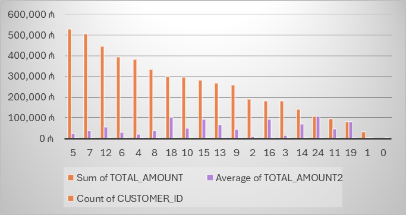

# Bank Customer, Transaction and Credit Analysis Project

## Project Objective: 
Analyze and visualize bank customer, account, transaction, and credit data to uncover insights on customer behavior, transaction trends, credit risk, and account performance using Excel, SQL, and data visualization techniques.

## Dataset
You can access the dataset used in this project:
[Download Bank Analysis Dataset](Datasets)

## Tables Used

### 1️⃣ CUSTOMERS – Customer Information

| Column | Description |
|--------|-------------|
| customer_id | Unique ID of the customer |
| full_name | Customer's full name |
| gender | Gender (Male/Female) |
| age | Age |
| city | City |
| registration_date | Date of registration with the bank |

---

### 2️⃣ ACCOUNTS – Customer Bank Accounts

| Column | Description |
|--------|-------------|
| account_id | Account ID |
| customer_id | Customer ID (foreign key) |
| account_type | Account type (Saving, Current) |
| balance | Current balance |
| open_date | Account opening date |
| status | Status (Active / Closed) |

---

### 3️⃣ TRANSACTIONS – Account Transactions

| Column | Description |
|--------|-------------|
| transaction_id | Transaction ID |
| account_id | Account ID (foreign key) |
| transaction_date | Transaction date |
| transaction_type | Type (Deposit, Withdrawal, Transfer) |
| amount | Amount |
| description | Transaction description |

---

### 4️⃣ CREDIT – Customer Credits

| Column | Description |
|--------|-------------|
| credit_id | Unique credit ID |
| customer_id | Customer ID (for joining with CUSTOMERS) |
| credit_amount | Credit amount |
| interest_rate | Interest rate (%) |
| start_date | Credit start date |
| end_date | Credit end date |
| status | Status (Active, Closed, Defaulted) |
| monthly_payment | Monthly payment |

## Project Overview
This project focuses on analyzing and visualizing banking data to provide actionable insights. The analysis is divided into the following key areas:

1. **Customer and Account Analysis**
   - Number of active accounts per customer and total balance.
   - Average account balance by city.
   - Account count and balance by customer age group.
   - Top 5 richest customers (highest balance).

2. **Transaction Analysis**
   - Total deposits and withdrawals per account.
   - Number of transactions and total amount per customer.
   - Accounts with the highest number of transactions.
   - Distribution of transaction types (Deposit, Withdrawal, Transfer).
   - Largest transaction per customer compared to their average transaction.

3. **Time and Trend Analysis**
   - Monthly and yearly transaction counts and amounts.
   - Monthly deposit vs. withdrawal trends.

4. **Credit Analysis**
   - Total credit per customer.
   - Credit status distribution (Active, Closed, Defaulted).
   - Average monthly credit payment per customer.
   - Profitability analysis based on credit interest.
   - Risky credit ratio by region/city.
   - First and last credit amounts per customer.

5. **Bonus Insights**
   - Comparison of active vs. closed account balances.
   - Largest transaction and date per customer.
   - Customer segmentation based on balance and transaction count (High, Medium, Low).
   - Credit-to-account balance ratio per customer.

Picture: 

 
 
