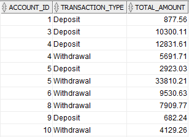

# Bank Customer, Transaction and Credit Analysis Project

## Project Objective: 
Analyze and visualize bank customer, account, transaction, and credit data to uncover insights on customer behavior, transaction trends, credit risk, and account performance using Excel, SQL, and data visualization techniques.

## Dataset
You can access the dataset used in this project:
[Download Bank Analysis Dataset](Datasets)

## Tables Used

### 1️⃣ CUSTOMERS – Customer Information

| Column | Description |
|--------|-------------|
| customer_id | Unique ID of the customer |
| full_name | Customer's full name |
| gender | Gender (Male/Female) |
| age | Age |
| city | City |
| registration_date | Date of registration with the bank |

---

### 2️⃣ ACCOUNTS – Customer Bank Accounts

| Column | Description |
|--------|-------------|
| account_id | Account ID |
| customer_id | Customer ID (foreign key) |
| account_type | Account type (Saving, Current) |
| balance | Current balance |
| open_date | Account opening date |
| status | Status (Active / Closed) |

---

### 3️⃣ TRANSACTIONS – Account Transactions

| Column | Description |
|--------|-------------|
| transaction_id | Transaction ID |
| account_id | Account ID (foreign key) |
| transaction_date | Transaction date |
| transaction_type | Type (Deposit, Withdrawal, Transfer) |
| amount | Amount |
| description | Transaction description |

---

### 4️⃣ CREDIT – Customer Credits

| Column | Description |
|--------|-------------|
| credit_id | Unique credit ID |
| customer_id | Customer ID (for joining with CUSTOMERS) |
| credit_amount | Credit amount |
| interest_rate | Interest rate (%) |
| start_date | Credit start date |
| end_date | Credit end date |
| status | Status (Active, Closed, Defaulted) |
| monthly_payment | Monthly payment |

## Project Overview
This project focuses on analyzing and visualizing banking data to provide actionable insights. The analysis is divided into the following key areas:

1. **Customer and Account Analysis**
   - Number of active accounts per customer and total balance.
   - Average account balance by city.
   - Account count and balance by customer age group.
   - Top 5 richest customers (highest balance).

2. **Transaction Analysis**
   - Total deposits and withdrawals per account.
   - Number of transactions and total amount per customer.
   - Accounts with the highest number of transactions.
   - Distribution of transaction types (Deposit, Withdrawal, Transfer).
   - Largest transaction per customer compared to their average transaction.

3. **Time and Trend Analysis**
   - Monthly and yearly transaction counts and amounts.
   - Monthly deposit vs. withdrawal trends.

4. **Credit Analysis**
   - Total credit per customer.
   - Credit status distribution (Active, Closed, Defaulted).
   - Average monthly credit payment per customer.
   - Profitability analysis based on credit interest.
   - Risky credit ratio by region/city.
   - First and last credit amounts per customer.

5. **Bonus Insights**
   - Comparison of active vs. closed account balances.
   - Largest transaction and date per customer.
   - Customer segmentation based on balance and transaction count (High, Medium, Low).
   - Credit-to-account balance ratio per customer.

## SQL Scripts & Visualizations

## I. Customer & Account Analysis

### **Question 1:** Number of active accounts per customer and total balance.

*SQL Script:* [Task 1](Scripts/task_1.1.sql)  

*Visualization:* 
 

> **Analysis Result:** Customers with a single account dominate both in number and total balance share.

---

### **Question 2:** Average account balance by city.

*SQL Script:* [Task 2](Scripts/task_1.2.sql)  

*Visualization:* 

> **Analysis Result:**
Sumqayit is the leader in customer activity and balance. Ganja and Lankaran maintain high balances, Sheki and Mingachevir excel in transaction activity, whereas Baku shows lower metrics in both aspects.

---
 
 ### **Question 3:** Account count and balance by customer age group. 
 *SQL Script:* [Task 3](Scripts/task_1.3.sql)  

*Visualization:* 

> **Analysis Result:** Age groups 28-37 and 68-77 are above the average;
Age groups 38-47 and 58-67 are below the average.

---

### **Question 4:** Top 5 richest customers (top balance).
 *SQL Script:* [Task 4](Scripts/task_1.4.sql)  

*Visualization:* 

---

## II. Transaction Analysis
### **Question 1:** Total deposits and withdrawals per account.
*SQL Script:* [Task 1](Scripts/task_2.1.sql)  

*Visualization:* 

> **Analysis Result:** Analysis Result: Total transactions: 3.24M ₼ — Deposits: 1.55M ₼ (188 accounts), Withdrawals: 1.68M ₼ (205 accounts).

---

### **Question 2:** Number of transactions and total amount per customer.
*SQL Script:* [Task 2](Scripts/task_2.2.sql)  

*Visualization:* 

> **Analysis Result:** 5–8 transactions → highest amounts. 10+ transactions → few but high-value. 1–3 transactions → many but low-value

---

### **Question 3:** Accounts with the highest number of transactions.
*SQL Script:* [Task 3](Scripts/task_2.3.sql)  

*Visualization:* 

---

### **Question 4:** Distribution of transaction types (Deposit, Withdrawal, Transfer).
*SQL Script:* [Task 4](Scripts/task_2.4.sql)  

*Visualization:* 

---

### **Question 5:** Largest transaction per customer compared to average transaction.
 *SQL Script:* [Task 5](Scripts/task_2.5.sql)  

*Visualization:* 

---

## III. Time & Trend Analysis
### **Question 1:** Monthly and yearly transaction counts and amounts.
 *SQL Script:* [Task 1](Scripts/task_3.1.sql)  

*Visualization:* 

### **Question 2:** Monthly deposit vs. withdrawal trend.
*SQL Script:* [Task 2](Scripts/task_3.2.sql)  

*Visualization:* 

---

## IV. Credit Analysis
### **Question 1:** Total credit per customer.
*SQL Script:* [Task 1](Scripts/task_4.1.sql)  

*Visualization:* 

### **Question 2:** Credit status distribution (Active, Closed, Defaulted).
*SQL Script:* [Task 2](Scripts/task_4.2.sql)  

*Visualization:* 

### **Question 3:** Average monthly credit payment per customer.
*SQL Script:* [Task 3](Scripts/task_4.3.sql)  

*Visualization:* 

### **Question 4:** Profitability analysis based on credit interest.
*SQL Script:* [Task 4](Scripts/task_4.4.sql)  

*Visualization:* 

### **Question 5:** Risky credit ratio by region/city.
*SQL Script:* [Task 5](Scripts/task_4.5.sql)  

*Visualization:* 

### **Question 6:** First and last credit amounts per customer.
*SQL Script:* [Task 6](Scripts/task_4.6.sql)  

*Visualization:* 

---

## V. Bonus Questions
### **Bonus 1:** Comparison of active vs. closed account balances.
*SQL Script:* [Bonus 1](Scripts/task_5.1.sql)  

*Visualization:*  

### **Bonus 2:** Largest transaction per customer and date.
*SQL Script:* [Bonus 2](Scripts/task_5.2.sql)  

*Visualization:* 

### **Bonus 3:** Customer segmentation based on balance and transaction count (High, Medium, Low).
*SQL Script:* [Bonus 3](Scripts/task_5.3.sql)  

*Visualization:* 

### **Bonus 4:** Credit-to-account balance ratio per customer.
*SQL Script:* [Bonus 4](Scripts/task_5.4.sql)  

*Visualization:* 